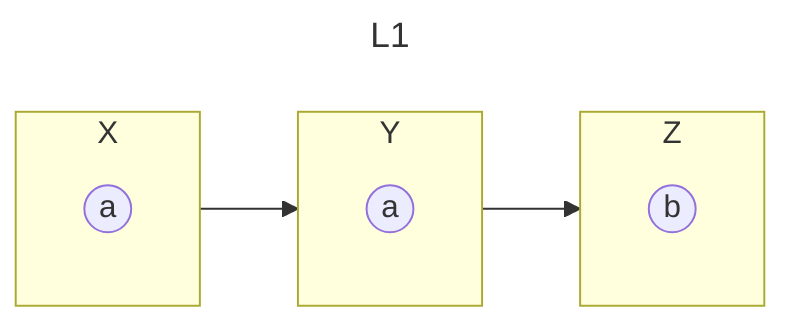
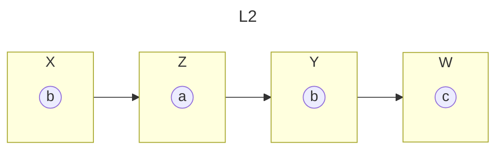

## Set

Un set non ammette ripetizioni

Siano due set:
- $S_1 = \{a,b,c\}$
- $S_2 = \{b,d,e,f\}$

Rappresentazione della relazione:

val | ID
--- | ---
$a$ | $S_1$
$b$ | $S_1$
$c$ | $S_1$
$b$ | $S_2$
$d$ | $S_2$
$e$ | $S_2$
$f$ | $S_2$


## bag

Siano due bag
- $B_1 = \{\{a,a,b\}\}$
- $B_2 = \{\{b,b\}\}$

In questo caso, non sarebbe sufficiente associare il nome della bag a un suo elemento per ottenere un identificatore, è necessario creare un nuovo attributo:

val | ID | Num
--- | --- | ---
$a$ | $B_1$ | 1
$a$ | $B_1$ | 2
$b$ | $B_1$ | 1
$b$ | $B_2$ | 2
$b$ | $B_2$ | 3

Oppure indicare la molteplicità all'interno della bag:

val | ID | Mul
--- | --- | ---
$a$ | $B_1$ | 2
$b$ | $B_1$ | 1
$b$ | $B_2$ | 2

## vettori

- $V_1 = (1, 5, 10) $
- $V_2 = (1, 7, 4) $

ID | $X_1$ | $X_2$ | $X_3$
--- | --- | --- | ---
$V_1$ | $1$ | $5$ | $10$
$V_2$ | $1$ | $7$ | $4$

## array

- $A_1 = \begin{bmatrix} a \\ a \\ b \end{bmatrix}$
- $A_2 = \begin{bmatrix} b \\ b \end{bmatrix} $

Hanno elementi ordinati; questa proprietà può essere espressa tramite l'attributo posizione:

val | ID | Pos
--- | --- | ---
$a$ | $A_1$ | 1
$a$ | $A_1$ | 2
$b$ | $A_1$ | 3
$b$ | $A_2$ | 1
$b$ | $A_2$ | 2


## liste






La rappresentazione sarebbe analoga a quella di un array, ma una struttura statica sarebbe scarsamente compatibile con la possibilità di aggiungere elementi (aggiungere una tupla comporterebbe che tutte le successive scalino di una posizione).

La migliore rappresentazione di questa proprietà richiede che le tuple conoscano la tupla a loro successiva e che ciascuna sia identificata all'interno della propria lista:

ID | ID_el | val | next*
--- | --- | --- | --- 
$L_1$ | $X$ | $a$ | $Y$
$L_1$ | $Y$ | $a$ | $Z$
$L_1$ | $Z$ | $b$ | NULL
$L_2$ | $X$ | $b$ | $Z$
$L_2$ | $Z$ | $a$ | $Y$
$L_2$ | $Y$ | $b$ | $W$
$L_2$ | $W$ | $c$ | NULL

A stabilire il primo elemento della lista c'è la necessità di identificarlo su base lista:

ID | ID_Header
--- | --- 
$L_1$ | $X$ 
$L_2$ | $X$ 

:::oss
La chiave per la prima relazione è $K=\{ID,ID_el,next\}$, ma sarebbe anche una *foreign key* ($FK=\{ID,ID_el,next\}$) perché applica un vincolo di integrità relazionale: l'elemento successivo (non-nullo) *deve* esistere.
:::

Aggiungere un elemento richiede di modificare il valore dell'attributo `next` dell'elemento prima del quale si vuole immettere la nuova tupla nella lista.

## alberi

```mermaid
---
title: A1
config:
  look: classic
  layout: dagre
---

stateDiagram
state 1 {
a
}
state 2 {
b
}
state 3 {
d
}
state 4 {
a(())
}
state 5 {
c
}
state 6 {
a(())
}

1 --> 2
1 --> 4
2 --> 3
4 --> 5
4 --> 6
```

ID | ID_EL | VAL | NEXT_L | NEXT_R
--- | --- | --- | --- | ---
$A_1$ | 1 | $a$ | 2 | 4
$A_1$ | 2 | $b$ | 3 |
$A_1$ | 3 | $d$ |  |
$A_1$ | 4 | $a$ | 5 | 6
$A_1$ | 5 | $c$ |  |
$A_1$ | 6 | $a$ |  |

dove abbiamo la chiave primaria $K=\{ID, ID_EL\}$,

possiamo stabilire anche due foreign key: 
- $FK_1=\{ID,NEXT_R\}$
- $FK_2=\{ID,NEXT_L\}$

Idealmente, potremmo ricostruire la parentela enumerando le ramificazioni che emettono ciascuna tupla, ma questo comporterebbe un numero potenzialmente illimitato di attributi tipo `next_i`, oltre a generare una struttura enormemente sparsa.

Un miglior modo di approcciarsi alla struttura ad albero è quello di sfuttare l'unicità del genitore (ogni tupla può averne al massimo 1):

ID | ID_EL | VAL | PAR | L_R
--- | --- | --- | --- | ---
$A_1$ | 1 | $a$ | NULL | NULL
$A_1$ | 2 | $b$ | 1 | L
$A_1$ | 3 | $d$ | 2 | L
$A_1$ | 4 | $a$ | 1 | R
$A_1$ | 5 | $c$ | 4 | L
$A_1$ | 6 | $a$ | 4 | R

Non c'è bisogno di specificare la radice perché è naturalmente l'unica tupla senza genitore.

Chiavi:
- $K_1 = \{ ID, PAR, L_R \} $
- $FK_1 = \{ ID, PAR \} $ referenzia il genitore

:::oss
Se i valori non fossero atomici?

Qualora i valori degli elementi dell'albero fossero a loro volta strutture annidate, allora saranno queste stesse strutture a conoscere l'identificativo (foreign key) al nodo dell'albero a cui appartiene (e l'attributo `VAL` sparisce).

## grafi


<!--  -->