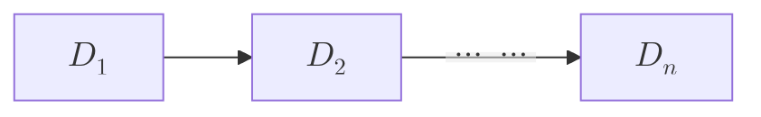

## Dispositivi in Serie

Data una serie di $n$ dispositivi in serie, ciascuno indipendente dagli altri, sia $D_k$ l'evento in cui il dispositivo $k$-esimo funzioni, con $D_1$,$D_2$...$D_n$ tutti indipendenti, sia la probabilità $p_k=P(D_k)$ che il dispositivo $k$-esimo funzioni

Vogliamo conoscere la probabilità di $E$, evento in cui l'intero sistema funzioni.

Abbiamo 

$$
\begin{array}{rl}
P(E) \!\!\!\! &= \bigcap_{k=1}^n P(D_k) = \\[8pts]
&= \prod_{k=1}^n p_k
\end{array}
$$

## Dispositivi in Parallelo

Data un sistema di $n$ dispositivi in parallelo, ciascuno indipendente dagli altri, sia $D_k$ l'evento in cui il dispositivo $k$-esimo funzioni, con $D_1$,$D_2$...$D_n$ tutti indipendenti, sia la probabilità $p_k=P(D_k)$ che il dispositivo $k$-esimo funzioni

Vogliamo conoscere la probabilità di $F$, evento in cui l'intero sistema funzioni, cosa che avviene se *almeno uno dei dispositivi funzioni*.

Abbiamo un calcolo molto lungo:

$$
\begin{array}{rl}
P(F) \!\!\!\! &= P(\bigcup_{k=1}^n D_k) = \\[8pts]
&= P(D_1) + P(D_2) + \ldots + P(D_k) - P(D_1 \cap D_2) - P(D_1 \cap D_3) - \ldots - P(D_{n-1} \cap D_n) + P(D_1 \cap D_2 \cap D_3) + \ldots - P(D_1 \cap D_2 \cap D_3 \cap D_4) \ldots
\end{array}
$$

Conviene provare con l'evento complementare $F^c$, cioè l'evento in cui nessuno dei dispositivi funzioni, che prevede un'unica casistica:

$$
\begin{array}{rl}
P(F) \!\!\!\! &= 1 - P(F^c) \\[8pts]
&= 1 - P(D^c_1 \cap D^c_2 \ldots D^c_n) = \\[8pts]
&= 1 - P(D^c_1)P(D^c_2)\ldots P(D^c_n) 
\end{array}
$$

:::nota
se $F = \bigcup_{k=1}^n D_k$

allora $F^c = (\bigcup_{k=1}^n D_k)^c = \bigcap_{k=1}^n D^c_k$

quindi, del caso precedente

$$
\begin{array}{rl}
P(F) &= 1 - P(D^c_1 \cap D^c_2 \ldots ) = \\[8pts]
&= 1 - P((\bigcup_{k=1}^n D_k)^c)
\end{array}
$$
:::

## Problema della Rovina del Giocatore

<!-- Cerca descrizione problema -->

A e B fanno il gioco seguente:
- lanciano una moneta, se esce "testa", allora B dà ad A una moneta, se esce "croce", allora B riceve da A una moneta
- il gioco prosegue finchè entrambi i giocatori hanno almeno una moneta

Inizialmente A ha $k$ monete, con $k \geq 1$ e $k < n$
e B ha $n-k$ monete (cioè le rimanenti)

Vogliamo conoscere la probabilità che A vinca (o viceversa che avvenga la rovina di B)

:::oss
Dobbiamo partire con la supposizione che il gioco possa iniziare (almeno una partita), quindi entrambi i giocatori devono avere almeno una moneta a testa.
:::

Sia $V$ l'evento in cui A vinca la partita, $T$ che esca testa e $C$ che esca croce

$$P(A) = P(V|T)P(T) + P(V|C)P(C)$$

Questa formula è quella delle *probabilità totali* applicata alla prima partita.

:::oss
La probabilità di vincere dipende dal numero iniziale di monete.
:::

sia $p_k = P(V)$ nel caso di $k$ monete, quindi
- $P(V|T) = P_{k+1}$ se esce "testa"
- $P(V|C) = P_{k-1}$ se esce "croce"

$$p_k = p_{k-1} P(T) p_{k-1}(1 - P(T))$$
$$(p_{k-1} - p_k) p = (p_k-p_{k-1}) q$$
$$p_{k+1} - p_k = q/p (p_k - p_{k-1})$$

sappiamo che $P_n = 1$ e $P_0 = 0$

per $k= 1$:
    $$p_2 - p_1 = q/p (p_1 - p_0) = q/p p_1$$
    $$p_3 - p_2 = q/p (p_2 - p_1) = (q/p)^2 p_1$$

per $k = n-1$
    $$p_n - p_{n-1} = q/p (p_{n-1} - p_{n-1}) = (q/p)^{n-1} p_1$$

sommando:

$$
p_n - p_1 = q/p p_1 + (q/p)^2p_1 + \ldots + (q/p)^{n-1}p_1
    $$

Se assumiamo anche che la moneta sia equilibrata ($50\%$ per ciascuna faccia), allora $p = \frac1{n}$ 
$$
p_k = \frac{1}{p_1 = q/p + (q/p)^2 + \ldots + (q/p)^{n-k}} 
$$
$$ p_k = \frac{k}{n} \text{ con } 1 \leq k < n$$

Nel caso in cui la moneta *non sia equilibrata*, cioè $ q \neq p$, abbiamo

$$
p_1 = \frac1{} \frac{ 1-q/p}{1- q/p} =

1 -q/p/1-(q/p)^n
$$

$$
p_k = \frac{1 - (q/p)^k}{1 - (q/p)^n}
$$